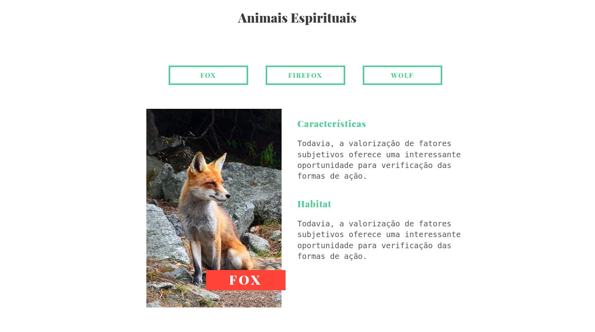

# Animais Esperituais 🚧

Projeto proposto pelo curso de JavaScript e JQuery da instituição de ensino Origamid.

Consiste em um site fictício simples que fala sobre características de alguns animais.
A estrutura HTML e o CSS vem pronto pois o foco do curso é a implementação do JQuery.

## Demonstração

## Objetivo

Por em prática o aprendizado sobre JavaScript e JQuery.